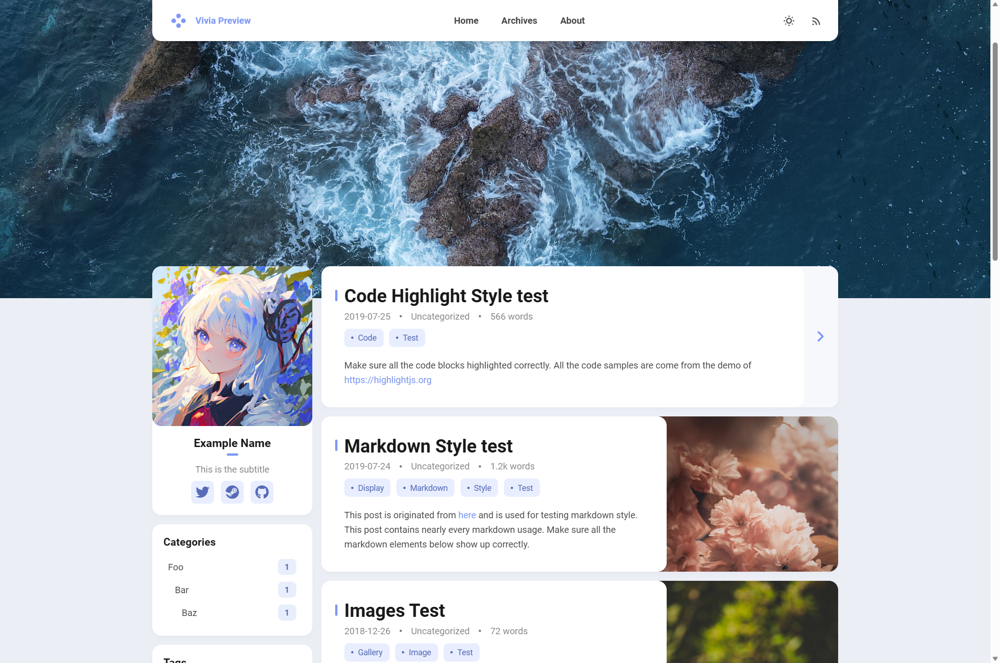
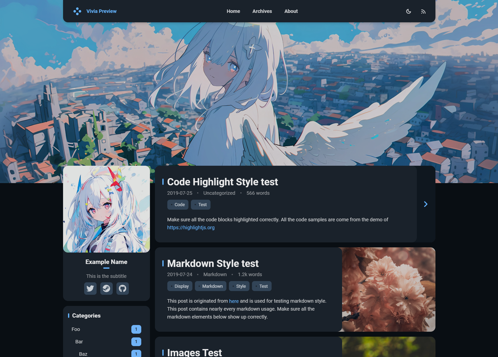

<br>
<div align="center">

<br>
<br>
<strong>
<a href="https://saicaca.github.io/vivia-preview/">Live Demo</a>
|
<a href="https://github.com/saicaca/hexo-theme-vivia/blob/main/README.zh-CN.md">中文文档</a>
</strong>
<br>
<br>
A theme for <a href="https://hexo.io/">Hexo</a>, modified from <a href="https://github.com/hexojs/hexo-theme-landscape">Landscape</a>. (Work in progress)
<br>
<br>
<a href="https://www.npmjs.com/package/hexo-theme-vivia">
   
</a>
<a href="https://github.com/saicaca/hexo-theme-vivia/blob/main/LICENSE">
   
</a>
</div>

# Preview

**[💻Live Demo](https://saicaca.github.io/vivia-preview/)**





# Install

> [!NOTE]
> All the following commands should be executed in the root directory of your Hexo blog

### 1. Install the Theme

Via npm (Recommended)

```bash
npm install hexo-theme-vivia
```

Via Git

```bash
# Clone the theme into the /themes/vivia directory
git clone https://github.com/saicaca/hexo-theme-vivia.git themes/vivia
  
# Install the required dependencies
npm install colorjs.io stylus hexo-symbols-count-time
```

### 2. Create the Theme Configuration File

Copy the example configuration file to your Hexo blog's root directory:

- If you installed the theme via npm, the file is located at `node_modules/hexo-theme-vivia/example_config.vivia.yml`.
- If you installed via Git, the file is in `themes/vivia/example_config.vivia.yml`.

After copying, rename this file to `_config.vivia.yml`.

### 3. Customize the Theme

Edit `_config.vivia.yml` and make any desired customizations.

### 4. Set `vivia` as the Theme

```bash
hexo config theme vivia
```

### 5. Create the `about` Page

```bash
hexo new page about
```

### 6. Disable the Pagination of Archive Page

Edit `_config.yml` and add the following lines:

```yaml
archive_generator:
  per_page: 0
```

Without this configuration, the archive page will only show up to ten articles at most.

# To-do list

- [x] Light / dark mode
- [x] Custom theme color
- [x] Custom banner
- [x] Responsive design
- [x] Comments
  - [x] Valine
  - [x] Twikoo
  - [ ] Others
- [ ] Search
- [ ] TOC widget

# Thanks

<a href="https://jb.gg/OpenSourceSupport">
   
</a>

- [Hexo](https://hexo.io/zh-cn/index.html)
- [Landscape](https://github.com/hexojs/hexo-theme-landscape)
- [Color.js](https://colorjs.io/)
- [Font Awesome](https://github.com/FortAwesome/Font-Awesome)
- [Material Icons / Material Symbols](https://github.com/google/material-design-icons)
