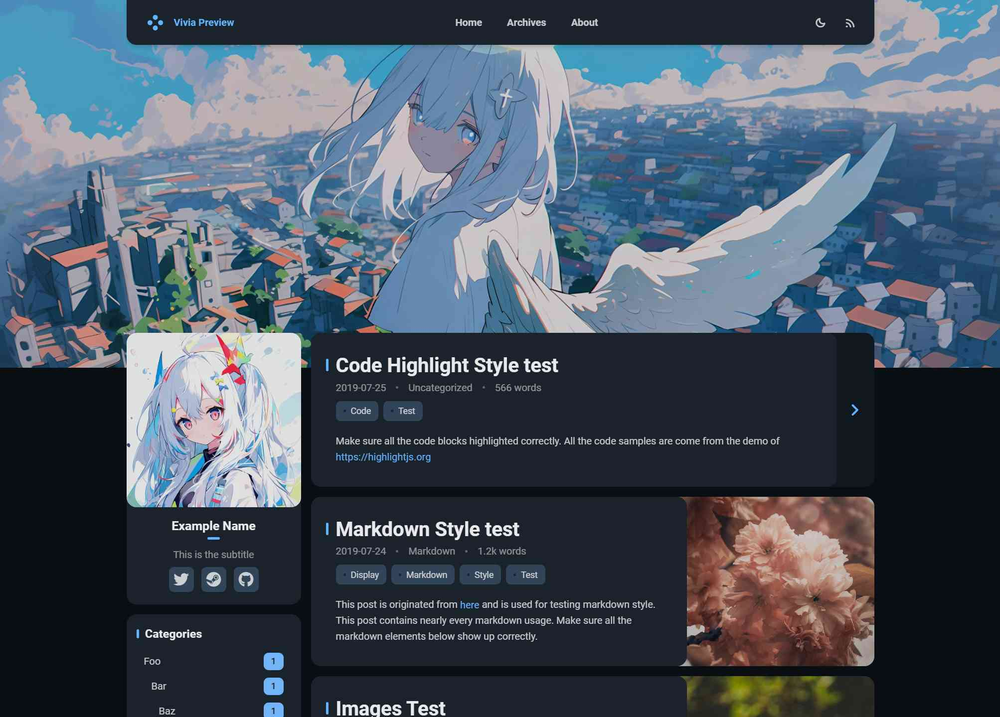

<br>
<div align="center">

<br>
<br>
<strong>
<a href="https://saicaca.github.io/vivia-preview/">在线预览</a>
|
<a href="https://github.com/saicaca/hexo-theme-vivia/blob/main/README.md">English</a>
</strong>
<br>
<br>
一款 <a href="https://hexo.io/">Hexo</a> 博客主题，基于 <a href="https://github.com/hexojs/hexo-theme-landscape">Landscape</a> 修改（开发中）
<br>
<br>
<a href="https://www.npmjs.com/package/hexo-theme-vivia">
   
</a>
<a href="https://github.com/saicaca/hexo-theme-vivia/blob/main/LICENSE">
   
</a>
</div>

## 预览

**[💻在线预览](https://saicaca.github.io/vivia-preview/)**




# 安装方式

## 方式一：通过 npm install 安装

1. 在 hexo 博客根目录执行以下命令

   ```bash
   npm install hexo-theme-vivia
   ```

2. 将配置文件 `node_modules/hexo-theme-vivia/example_config.vivia.yml` 复制至 Hexo 根目录并重命名为 `_config.vivia.yml`。

3. 编辑 Hexo 配置文件 `_config.yml`，设置 `vivia` 为主题。

   ```yaml
   theme: vivia
   ```

4. 创建 `about` 页面

   ```bash
   hexo new page about
   ```

## 方式二：直接将项目复制到 hexo 博客的 themes 目录

1. 在 hexo 博客的 `theme` 目录下执行以下命令

   ```bash
   cd themes
   git clone <本项目的 git 链接> vivia
   # 仓库名为 hexo-theme-vivia, 本地另存为 vivia 方便配置
   ```

2. 编辑 Hexo 根目录的配置文件 `_config.yml`，设置 `vivia` 为主题。

   ```yaml
   theme: vivia
   ```

   如果代码高亮出现问题，请设置 `prismjs: enable: true`
   
   然后把本项目下的 `example_config.vivia.yml` 的内容添加到本项目`theme`下的 `_config.yml` 中。
   
   >或者在`博客根目录`创建 `_config.vivia.yml` 并写入example配置里的内容。如果报错 WARN No layout，请检查仓库 clone 到本地之后是否叫做 vivia 。

   >为什么不直接把配置写进_config.yml，让我们下载就直接用呢？主要是照顾到npm的安装方法，防止 node_modules 模块更新的时候覆盖掉一部分用户的 _config.yml 配置文件）。

3. 创建 `about` 页面

   ```bash
   hexo new page about
   ```
4. 安装必要的 nodejs 模块

   ```bash
   npm install colorjs.io
   # 或者 `yarn add colorjs.io`
   ```

5. 编译博客并查看效果
   ```bash
   hexo clean    # 清除旧的缓存文件
   hexo server   # 临时本地服务，便于调试
   hexo generate # 编译 markdown 文件并生成静态 html 网站
   ```

# To-do

- [x] 亮 / 暗模式
- [x] 自定义主题色
- [x] 自定义头图
- [x] 响应式设计
- [x] 评论
  - [x] Valine
  - [ ] 其他
- [ ] 搜索
- [ ] 文内目录插件
- [ ] 优化内文样式

# 致谢
<a href="https://jb.gg/OpenSourceSupport">
   
</a>
