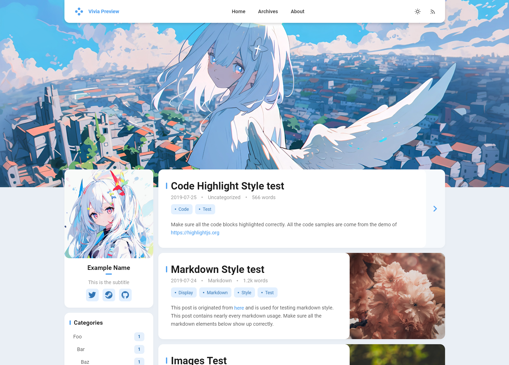
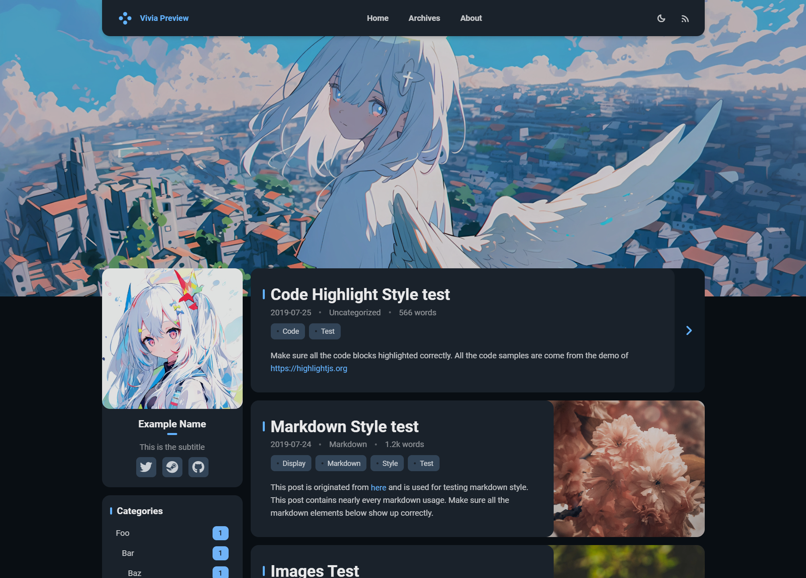

# hexo-theme-vivia

 

一款为 [Hexo](https://hexo.io/) 开发的主题，基于 [Landscape](https://github.com/hexojs/hexo-theme-landscape) 修改。 (开发中)

## 预览

**[在线预览](https://saicaca.github.io/vivia-preview/)**





## 安装

1. 通过 npm 安装主题。

   ```bash
   npm install hexo-theme-vivia
   ```
   
2. 将配置文件 `node_modules/hexo-theme-vivia/example_config.vivia.yml` 复制至 Hexo 根目录并重命名为 `_config.vivia.yml`。

3. 编辑 Hexo 配置文件 `_config.yml`，设置 `vivia` 为主题。

   ```yaml
   theme: vivia
   ```

4. 创建 `about` 页面

   ```bash
   hexo new page about
   ```

## To-do

- [x] 亮 / 暗模式
- [x] 自定义主题色
- [x] 自定义头图
- [x] 响应式设计
- [x] 评论
  - [x] Valine
  - [ ] 其他
- [ ] 搜索
- [ ] 文内目录插件
- [ ] 优化内文样式

## 致谢
<a href="https://jb.gg/OpenSourceSupport">
   
</a>
